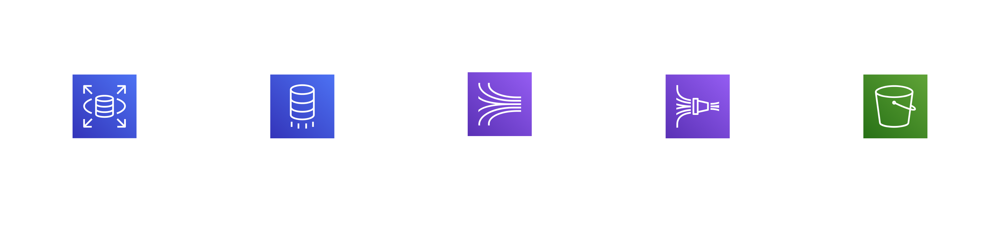

# One-Step CDC (Change Data Capture) Pipeline with AWS and Terraform

> Last Updated: 2025-05-07

## 📋 Project Overview

This project contains Terraform infrastructure code to build a real-time data pipeline using AWS services.

### Key Components
- **Amazon RDS**: Source database
- **AWS DMS**: Database Migration Service
- **Amazon Kinesis**: Real-time data streaming
- **Amazon Data Firehose**: Data delivery
- **Amazon S3**: Data storage

## 🏗️ Architecture


## 🔧 Version Requirements

- **Terraform**: `v1.11.4` 
- **AWS CLI**: `v2.17.51`
- **Required Permissions**: AWS account and IAM user access

## 📚 References
- [Terraform Official Website](https://developer.hashicorp.com/terraform/install)
- [AWS CLI Official Documentation](https://docs.aws.amazon.com/cli/latest/userguide/getting-started-install.html)

## 🚀 Setup and Installation (MacOS)

### 1. Install Required Tools
```bash
# Update Homebrew
brew update

# Install Terraform
brew install terraform

# Install AWS CLI
brew install awscli
```

### 2. Create AWS IAM User and Generate Access Keys
- Create an IAM User in the AWS Console
- Retrieve the Access Key ID and Secret Access Key
- Ensure appropriate permissions are assigned
- Example permission policy:
    ```json
    {
        "Version": "2012-10-17",
        "Statement": [
            {
                "Sid": "EC2Permissions",
                "Effect": "Allow",
                "Action": "ec2:*",
                "Resource": "*"
            },
            {
                "Sid": "RDSPermissions",
                "Effect": "Allow",
                "Action": "rds:*",
                "Resource": "*"
            },
            {
                "Sid": "KinesisPermissions",
                "Effect": "Allow",
                "Action": "kinesis:*",
                "Resource": "*"
            },
            {
                "Sid": "S3Permissions",
                "Effect": "Allow",
                "Action": "s3:*",
                "Resource": "*"
            },
            {
                "Sid": "FirehosePermissions",
                "Effect": "Allow",
                "Action": "firehose:*",
                "Resource": "*"
            },
            {
                "Sid": "DMSPermissions",
                "Effect": "Allow",
                "Action": "dms:*",
                "Resource": "*"
            },
            {
                "Sid": "IAMPermissions",
                "Effect": "Allow",
                "Action": "iam:*",
                "Resource": "*"
            },
            {
                "Sid": "CloudWatchPermissions",
                "Effect": "Allow",
                "Action": "logs:*",
                "Resource": "*"
            }
        ]
    }
    ```

### 3. Configure AWS Authentication
```bash
# Create AWS profile
aws configure --profile terraform

# Enter IAM user credentials
AWS Access Key ID [None]:   
AWS Secret Access Key [None]: 
Default region name [None]: 
Default output format [None]: 
```

### 4. Clone and Initialize Project
```bash
# Clone the project
git clone --branch CDC-pipeline --single-branch https://github.com/MinhoJJang/Terraform-Study.git

cd Terraform-Study

# Initialize Terraform
terraform init
```

### 5. Configure Environment Variables
Review and modify the following variables in the `terraform.tfvars` file as needed:

| Variable | Description | Default Value |
|----------|-------------|---------------|
| `name_prefix` | Resource name prefix | `mhj` |
| `profile` | AWS profile name (from step 3) | `cdc-tf` |
| `rds_username` | RDS database username | `root` |
| `rds_password` | RDS database password | `rdsPassword123!` |
| `region` | AWS region | `ap-northeast-2` |
| `vpc_cidr` | VPC CIDR block | `192.168.0.0/16` |

## ▶️ Deployment

### 1. Check for Resource Conflicts
- Verify that there are no conflicting existing AWS resources (VPC, RDS, DMS, Kinesis, S3)
- Modify variable values in `terraform.tfvars` if necessary

### 2. Deploy Infrastructure
```bash
sh run.sh

# Press Enter to use default values
Enter your name prefix [mhj]: 
Enter the RDS username [root]: 
Enter the RDS password [rd***********3!]: 
Enter the AWS profile name [cdc-tf]: 

Are you sure you want to proceed with these values? Type 'yes' to continue: # Only 'yes' will proceed

...

Do you want to perform these actions?
  Terraform will perform the actions described above.
  Only 'yes' will be accepted to approve.

  Enter a value: # Only 'yes' will proceed
```

## Testing CDC Pipeline with Sample Data

### 1. Verify RDS Environment Variables
```bash
# Check RDS endpoint
terraform output rds_endpoint

# Default RDS username
root

# Default RDS password
rdsPassword123!
```

### 2. Connect to RDS
- Use a MySQL client tool to connect to the RDS instance

### 3. Insert Sample Data
- Use the data provided in `shop.sql`

## Verify Data Pipeline

- Check database data
- Verify pipeline status in the DMS console
- Monitor data flow in the Kinesis console
- Confirm data delivery in the Kinesis Data Firehose console
- Validate data storage in S3

## Teardown Infrastructure (Cost Warning)
```bash
terraform destroy
```

## 📚 References
- Cloud Club 6th Terraform Study Blog
- [One-Step CDC Pipeline with Terraform (feat. AWS)](https://medium.com/@cloudclub/6%EA%B8%B0-%EC%8B%9C%EC%A6%8C-1-%EC%8A%A4%ED%84%B0%EB%94%94-cdc-with-terraform-f0f28b4adc2b)
